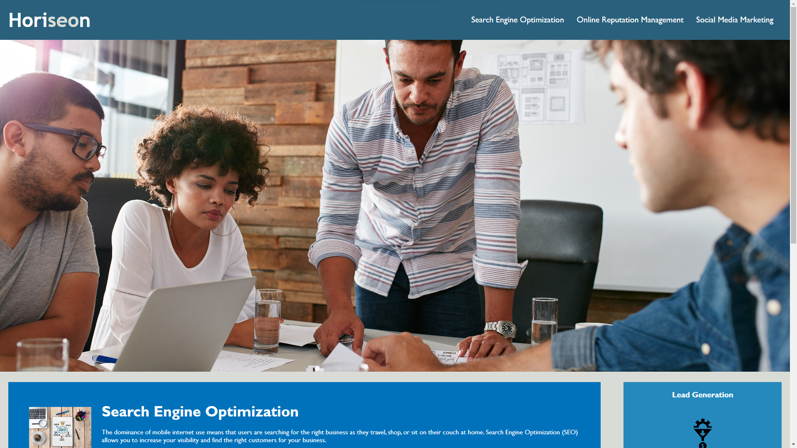

# Horiseon Refactor

## Description of Refactor

The challenge of our assignment was to refactor the existing website for "Horiseon Social Solution Services, Inc". We where told to fix and issues affecting their current website and making it more accessible for the public.

## Table of Contents

- [Refactor](#Refactor)
- [Screenshots](#Screenshots)
- [Link](#license)
- [Credits](#credits)

## Refactor

1. Ensured web browser title read Horiseon
2. Used structure and semantic HTML elements to make it easy to read, and added the proper headers 
3. Added alt attributes to all sources that needed it
4. Removed divs and consolidated the CSS to make it easier to read 

## Screenshots

Horiseon Website Screenshots.

## Links

-

## Credits/Resources

- Diarmuid Murphy (Instructor)
- Meg Meyers (TA) 

- How to create a readme (https://meakaakka.medium.com/a-beginners-guide-to-writing-a-kickass-readme-7ac01da88ab3)

